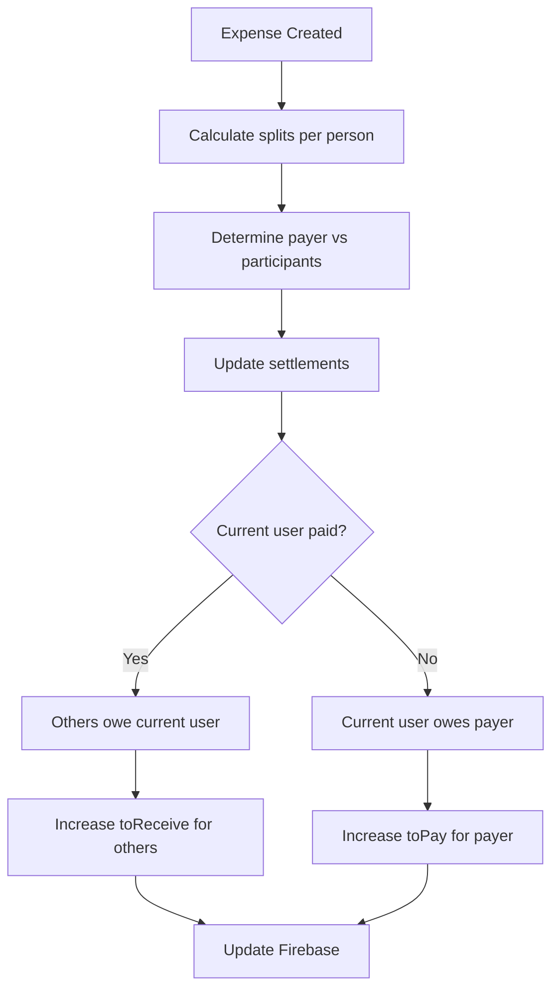

# 📚 Hostel Ledger - Complete App Logic Documentation

## 🏗️ **ARCHITECTURE OVERVIEW**

Your expense tracking app follows a **layered architecture** with clear separation of concerns:

```
┌─────────────────────────────────────────────────────────────┐
│                    UI COMPONENTS LAYER                      │
│  Dashboard, Groups, GroupDetail, Sheets, Modals           │
└─────────────────────────────────────────────────────────────┘
                              │
┌─────────────────────────────────────────────────────────────┐
│                   CONTEXT LAYER                            │
│  FirebaseAuthContext, FirebaseDataContext                 │
└─────────────────────────────────────────────────────────────┘
                              │
┌─────────────────────────────────────────────────────────────┐
│                   BUSINESS LOGIC LAYER                     │
│  expenseLogic.ts, validation.ts, transaction.ts           │
└─────────────────────────────────────────────────────────────┘
                              │
┌─────────────────────────────────────────────────────────────┐
│                   DATA LAYER                               │
│  Firebase Realtime Database, Authentication               │
└─────────────────────────────────────────────────────────────┘
```

---

## 🔐 **AUTHENTICATION & USER MANAGEMENT**

### **FirebaseAuthContext.tsx**
**Purpose:** Manages user authentication and personal financial data

#### **Core Functions:**
- `signInWithGoogle()` - Google OAuth authentication
- `signOut()` - User logout
- `getWalletBalance()` - Current user's wallet balance
- `addMoneyToWallet()` - Add money to personal wallet
- `deductMoneyFromWallet()` - Remove money from wallet

#### **Settlement System:**
- `getSettlements(groupId?)` - Get debt/credit amounts per person/group
- `getTotalToReceive()` - Total money others owe you
- `getTotalToPay()` - Total money you owe others
- `getSettlementDelta()` - Net settlement amount (receive - pay)
- `updateSettlement()` - Update debt/credit amounts
- `markPaymentReceived()` - Process incoming payment
- `markDebtPaid()` - Process outgoing payment

#### **Data Structure:**
```typescript
User: {
  uid: string,
  name: string,
  email: string,
  walletBalance: number,
  settlements: {
    [groupId]: {
      [personId]: {
        toReceive: number,  // They owe you
        toPay: number       // You owe them
      }
    }
  }
}
```

---

## 📊 **DATA MANAGEMENT**

### **FirebaseDataContext.tsx**
**Purpose:** Manages groups, transactions, and business operations

#### **Group Management:**
- `createGroup()` - Create new expense group
- `updateGroup()` - Modify group details
- `deleteGroup()` - Remove group
- `addMemberToGroup()` - Add person to group
- `removeMemberFromGroup()` - Remove person from group
- `getGroupById()` - Retrieve specific group

#### **Transaction Management:**
- `addExpense()` - Create new expense with splitting logic
- `recordPayment()` - Record payment between members
- `payMyDebt()` - Pay debt to another member
- `addMoneyToWallet()` - Add money to personal wallet
- `getAllTransactions()` - Get all user transactions
- `getTransactionsByGroup()` - Get group-specific transactions

#### **Data Structure:**
```typescript
Group: {
  id: string,
  name: string,
  emoji: string,
  members: GroupMember[],
  createdBy: string,
  createdAt: string
}

Transaction: {
  id: string,
  groupId: string,
  type: "expense" | "payment" | "wallet_add" | "wallet_deduct",
  title: string,
  amount: number,
  date: string,
  paidBy: string,
  participants?: Participant[],
  from?: string,
  to?: string,
  method?: "cash" | "online"
}
```

---

## 🧮 **BUSINESS LOGIC LAYER**

### **expenseLogic.ts**
**Purpose:** Core mathematical calculations for expense splitting and settlements

#### **Expense Splitting Logic:**
```typescript
calculateExpenseSplit(totalAmount, participants, payerId)
```
- **Input:** Total expense amount, list of participants, who paid
- **Logic:** 
  - Divide amount equally among participants
  - Distribute remainder fairly (rotate who gets extra)
  - Prevent same people from always paying more
- **Output:** Array of splits with exact amounts per person

#### **Settlement Calculation:**
```typescript
calculateExpenseSettlements(splits, payerId, currentUserId, groupId)
```
- **Logic:**
  - If current user paid: Others owe their share to current user
  - If someone else paid: Current user owes their share to payer
  - Updates `toReceive` and `toPay` amounts accordingly

#### **Settlement Validation:**
```typescript
validateSettlementConsistency(groupSettlements, currentUserId)
```
- **Rules:**
  - User cannot owe money to themselves
  - Either `toReceive` OR `toPay` should be 0 (not both positive)
  - No negative settlement amounts
  - Total receivables should equal total payables

#### **Payment Validation:**
```typescript
validatePaymentAmount(paymentAmount, actualDebt, allowOverpayment)
```
- **Logic:** Ensure payment doesn't exceed actual debt (unless overpayment allowed)

### **validation.ts**
**Purpose:** Input validation and data sanitization

#### **Validation Functions:**
- `validateExpenseData()` - Validate expense inputs
- `validatePaymentData()` - Validate payment inputs
- `validateGroupData()` - Validate group creation inputs
- `validateAmount()` - Ensure amounts are positive numbers
- `sanitizeString()` - Clean text inputs
- `sanitizeAmount()` - Clean numeric inputs

### **transaction.ts**
**Purpose:** Transaction management with rollback capability

#### **TransactionManager Class:**
- **Atomic Operations:** All-or-nothing transaction execution
- **Rollback Support:** Undo operations if any step fails
- **Error Handling:** Comprehensive error logging and recovery

---

## 🔄 **CORE WORKFLOWS**

### **1. CREATE EXPENSE WORKFLOW**

```mermaid
graph TD
    A[User clicks "Add Expense"] --> B[Open AddExpenseSheet]
    B --> C[User fills: amount, participants, note]
    C --> D[Validate inputs]
    D --> E[Calculate expense splits]
    E --> F[Calculate settlement updates]
    F --> G[Create transaction record]
    G --> H[Update settlements for all participants]
    H --> I[Update UI displays]
```

#### **Detailed Steps:**
1. **UI Input:** User enters expense details in `AddExpenseSheet`
2. **Validation:** `validateExpenseData()` checks inputs
3. **Split Calculation:** `calculateExpenseSplit()` divides amount fairly
4. **Settlement Calculation:** `calculateExpenseSettlements()` determines who owes what
5. **Transaction Creation:** Save expense record to Firebase
6. **Settlement Updates:** Update `toReceive`/`toPay` for all participants
7. **UI Sync:** Dashboard and group displays update automatically

### **2. RECORD PAYMENT WORKFLOW**

```mermaid
graph TD
    A[User clicks "Received"] --> B[Open RecordPaymentSheet]
    B --> C[Select group and member]
    C --> D[Enter payment amount]
    D --> E[Validate payment against debt]
    E --> F[Create payment transaction]
    F --> G[Update receiver's wallet]
    G --> H[Update settlements]
    H --> I[Update UI displays]
```

#### **Detailed Steps:**
1. **UI Input:** User selects member and enters amount in `RecordPaymentSheet`
2. **Validation:** Check payment amount against actual debt
3. **Transaction Creation:** Save payment record to Firebase
4. **Wallet Update:** Add money to receiver's wallet (`addMoneyToWallet`)
5. **Settlement Update:** Reduce `toReceive` amount for payer
6. **UI Sync:** All balances and settlements update

### **3. SETTLEMENT CALCULATION WORKFLOW**



---

## 🔗 **FUNCTION INTERCONNECTIONS**

### **Authentication → Data Flow**
```
FirebaseAuthContext.getWalletBalance()
    ↓
Dashboard.walletBalance
    ↓
WalletCard display
```

### **Expense Creation Flow**
```
Dashboard.handleAddExpense()
    ↓
AddExpenseSheet.onSubmit()
    ↓
FirebaseDataContext.addExpense()
    ↓
expenseLogic.calculateExpenseSplit()
    ↓
expenseLogic.calculateExpenseSettlements()
    ↓
FirebaseAuthContext.updateSettlement()
    ↓
UI updates automatically via React state
```

### **Payment Recording Flow**
```
Dashboard.handlePaymentSubmit()
    ↓
FirebaseDataContext.recordPayment()
    ↓
FirebaseAuthContext.addMoneyToWallet()
    ↓
FirebaseAuthContext.updateSettlement()
    ↓
Dashboard displays update
```

### **Settlement Display Flow**
```
FirebaseAuthContext.getSettlements()
    ↓
Dashboard.getTotalToReceive()
    ↓
Dashboard.getTotalToPay()
    ↓
Dashboard.getSettlementDelta()
    ↓
WalletCard settlement display
```

---

## 📱 **UI COMPONENT RELATIONSHIPS**

### **Main Navigation Flow**
```
App.tsx
├── Dashboard (home)
│   ├── WalletCard
│   ├── QuickActions
│   └── TransactionList
├── Groups (groups list)
│   └── GroupCard[]
├── GroupDetail (specific group)
│   ├── MemberList
│   ├── TransactionHistory
│   └── ActionButtons
└── BottomNav
```

### **Sheet Components (Modals)**
```
AddExpenseSheet
├── Group selection
├── Amount input
├── Participant selection
└── Submit logic

RecordPaymentSheet
├── Group selection
├── Member selection
├── Amount input
└── Submit logic

MemberSettlementSheet
├── Settlement display
├── Payment options
└── Quick actions
```

---

## 🗄️ **DATABASE STRUCTURE**

### **Firebase Realtime Database Schema**
```
hostel-ledger/
├── users/
│   └── {userId}/
│       ├── uid: string
│       ├── email: string
│       ├── name: string
│       ├── walletBalance: number
│       └── settlements/
│           └── {groupId}/
│               └── {personId}/
│                   ├── toReceive: number
│                   └── toPay: number
├── groups/
│   └── {groupId}/
│       ├── id: string
│       ├── name: string
│       ├── emoji: string
│       ├── members: Member[]
│       ├── createdBy: string
│       └── createdAt: string
├── transactions/
│   └── {transactionId}/
│       ├── id: string
│       ├── groupId: string
│       ├── type: string
│       ├── amount: number
│       ├── paidBy: string
│       ├── participants: Participant[]
│       └── ...metadata
└── userGroups/
    └── {userId}/
        └── {groupId}: true
```

---

## 🔄 **DATA SYNCHRONIZATION**

### **Real-time Updates**
Your app uses Firebase Realtime Database listeners for live updates:

1. **User Data Listener:** Watches user's wallet and settlements
2. **Groups Listener:** Watches user's groups
3. **Transactions Listener:** Watches user's transactions

### **Update Propagation**
```
Database Change
    ↓
Firebase Listener
    ↓
Context State Update
    ↓
React Re-render
    ↓
UI Updates Automatically
```

---

## 🧪 **ERROR HANDLING & VALIDATION**

### **Validation Layers**
1. **UI Validation:** Form validation in components
2. **Business Logic Validation:** In context functions
3. **Database Validation:** Firebase security rules
4. **Runtime Validation:** Try-catch blocks and error boundaries

### **Error Recovery**
- **Transaction Rollback:** Atomic operations with rollback capability
- **Retry Logic:** Automatic retry for network failures
- **User Feedback:** Clear error messages and recovery suggestions
- **Logging:** Comprehensive error logging for debugging

---

## 🎯 **KEY DESIGN PRINCIPLES**

### **1. Separation of Concerns**
- **UI Components:** Only handle display and user interaction
- **Contexts:** Manage state and business logic
- **Utility Functions:** Handle calculations and validation
- **Firebase:** Data persistence and real-time sync

### **2. Data Consistency**
- **Atomic Transactions:** All-or-nothing operations
- **Settlement Validation:** Mathematical consistency checks
- **Real-time Sync:** Immediate UI updates across all components

### **3. User Experience**
- **Optimistic Updates:** UI updates immediately, syncs in background
- **Error Recovery:** Clear error messages and retry options
- **Mobile-First:** Responsive design for mobile devices
- **Dark Theme:** Consistent glassmorphism design system

### **4. Scalability**
- **Modular Architecture:** Easy to add new features
- **Firebase Backend:** Handles scaling automatically
- **Component Reusability:** Shared components across features
- **Type Safety:** TypeScript for better code quality

---

## 🚀 **PERFORMANCE OPTIMIZATIONS**

### **React Optimizations**
- **useMemo:** Expensive calculations cached
- **useCallback:** Function references stable
- **Context Splitting:** Separate auth and data contexts
- **Lazy Loading:** Components loaded on demand

### **Firebase Optimizations**
- **Indexed Queries:** Efficient data retrieval
- **Listener Management:** Proper cleanup to prevent memory leaks
- **Batch Operations:** Multiple updates in single transaction
- **Offline Support:** Firebase handles offline scenarios

---

## 🔧 **MAINTENANCE & DEBUGGING**

### **Logging System**
- **Transaction Logging:** All financial operations logged
- **Error Logging:** Comprehensive error tracking
- **Performance Logging:** Operation timing and success rates

### **Testing Strategy**
- **Unit Tests:** Core logic functions tested
- **Integration Tests:** Context and component interactions
- **Firebase Rules Testing:** Security rule validation
- **Manual Testing:** User workflow validation

---

This documentation provides a complete overview of how your expense tracking app works, from the high-level architecture down to the specific function relationships. Each component has a clear purpose and well-defined interactions with other parts of the system.